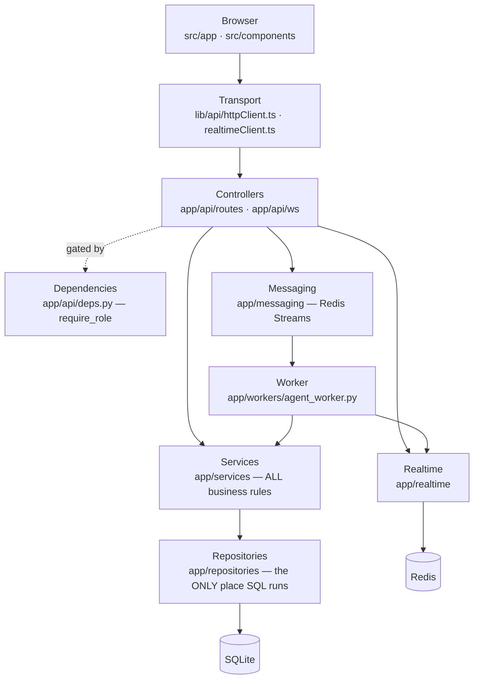

# Technical process documentation

One document per business process, each tracing the real call chain —
component → controller → service → repository → database — with the exact method
names, the guards at each layer, and the failure modes.

These describe **what the code does today**. Where the implementation differs
from the blueprint in [Design.md](Design.md), the process document says so
rather than describing the blueprint.

## The processes

| Process | Trigger | Entry point |
|---|---|---|
| [Book an appointment by chatting](process-chat-booking.md) | Message on `/ws/chat` | `ChatWebSocketController.chat` |
| [Book from the doctor page](process-direct-booking.md) | *Book* button | `AppointmentController.book` |
| [Reschedule](process-reschedule.md) ⚠️ | Front desk | `AppointmentController.cancel` + `book` |
| [Register a patient](process-patient-registration.md) | Signup form, or the agent | `AuthController.register` / `register_patient` tool |
| [The visit: check-in → treatment → checkout](process-visit-lifecycle.md) | Front desk and doctor | `AppointmentController.check_in` / `treatment` / `checkout` |
| [Request a prescription refill](process-refill-request.md) | Chat | `request_refill` tool |
| [Invoice and payment](process-billing.md) | Checkout, then staff | `BillingService.generate_invoice_for_appointment` |
| [Onboard a doctor and build a schedule](process-doctor-onboarding.md) | Admin console | `AdminController.create_doctor` / `generate_schedule` |
| [Authentication and authorisation](process-authentication.md) | Every request | `AuthController.login`, `require_role` |
| [Reconnect, resume, cross-instance delivery](process-reconnect-resume.md) | Socket drops, pod dies | `RealtimeChatClient` / `RealtimeDispatcher` |

⚠️ **Reschedule is not implemented.** The blueprint specifies it; the code has
cancel and book as separate, non-atomic operations, and the chat agent has no
tool for it at all. [The document](process-reschedule.md) explains what exists
and what a real implementation would need.

## How to read the call chains

Every process follows the same layering, so a diagram can be read top to bottom
as "who is allowed to know what":

Three rules hold in every process document:

1. **Controllers hold no business logic.** They unpack the request, call one
   service, and return. `AppointmentController.book` is literally one line.
2. **Services own the rules, repositories own the transactions.** Lifecycle
   checks, validation and error types live in `app/services`. Atomicity —
   no double-booking, no negative stock — lives in `app/repositories`.
3. **Errors are types, not status codes.** Services raise `AppointmentError`,
   `BillingError`, `PharmacyError`, `AdminError`, `AuthError`.
   [`DomainErrorRegistrar`](../backend/app/core/errors.py) maps them to HTTP once,
   centrally, so no controller writes `try/except HTTPException`.

## Where the atomic guarantees are

Everything that must not race is one transaction in one repository method:

| Guarantee | Method |
|---|---|
| No double-booking | [`DomainRepository.book_appointment`](../backend/app/repositories/domain.py) |
| No negative stock, no partial dispense | [`PharmacyRepository.prescribe`](../backend/app/repositories/pharmacy.py) |
| Cancelling frees the slot | `DomainRepository.set_appointment_status(..., free_slot=True)` |
| No duplicate invoice | `BillingService.generate_invoice_for_appointment` (idempotent on `appointment_id`) |
| No duplicate chat turn | `IdempotencyGuard.claim` + `ConversationRepository.message_exists` |
| No duplicate agent run | `IdempotencyGuard.claim("agent-run", event_id)` |
| No duplicate schedule slot | `DomainRepository.slot_exists` before `create_slot` |

## Open issues surfaced by writing these

Each is described in context in the linked document. None is a regression — they
are pre-existing, and recorded rather than silently fixed.

| Issue | Where |
|---|---|
| Reschedule does not exist; cancel + book is not atomic, race-free or idempotent | [reschedule](process-reschedule.md#why-this-is-not-a-reschedule) |
| `POST /api/appointments` is ungated and takes `patient_id` from the body | [direct booking](process-direct-booking.md#known-gap) |
| Patient signup creates the `Patient` before the `User`, so a duplicate email strands a row | [registration](process-patient-registration.md#the-ordering-hazard) |
| Treatment and dispensing are two transactions in one request | [visit lifecycle](process-visit-lifecycle.md#two-things-worth-knowing) |
| Dispensed medicines are never billed | [billing](process-billing.md#two-things-worth-knowing) |
| Invoice reads are not ownership-checked | [billing](process-billing.md#access-control-note) |
| `REFILL_REQUESTED` / `REFILL_COMPLETED` topics are defined but unused | [refill](process-refill-request.md#gaps-against-the-design-document) |

## Related

- [Design.md](Design.md) — the architecture blueprint, and Appendix A's map of it to the code
- [../README.md](../README.md) — running the stack
- [../backend/README.md](../backend/README.md) · [../frontend/README.md](../frontend/README.md) — layer-by-layer layout
