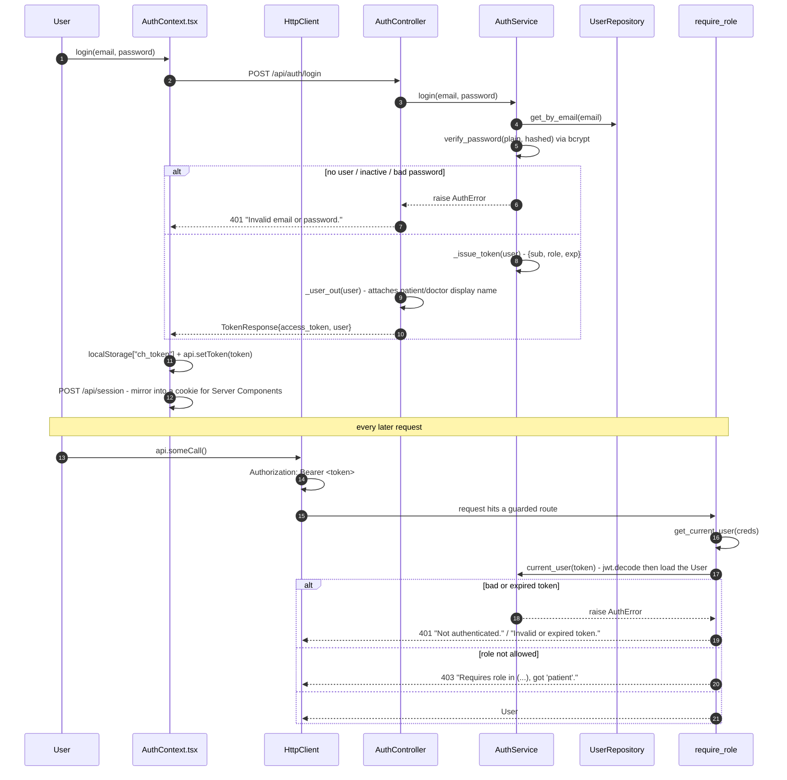
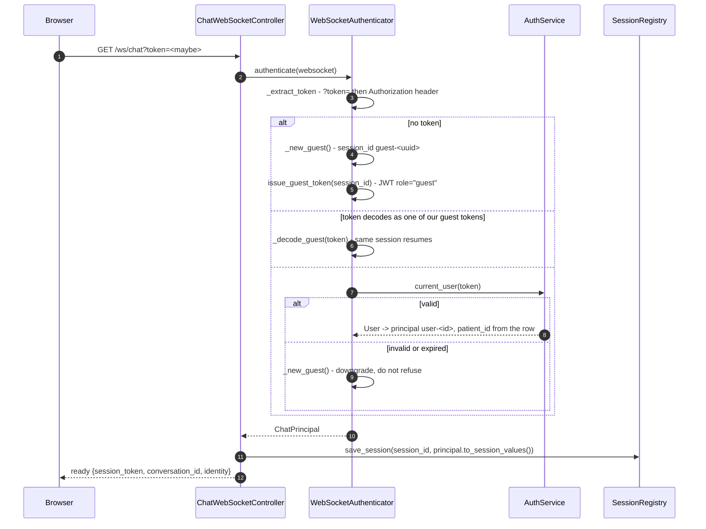

# Process — Authentication and authorisation

Two identity systems share one JWT secret: **user logins** for staff and
registered patients, and **guest chat sessions** for anonymous visitors. Both
are minted server-side; neither is ever asserted by the browser.

| | |
|---|---|
| **Login** | `POST /api/auth/login` → [`AuthController.login`](../backend/app/api/routes/auth.py) |
| **Current user** | `GET /api/auth/me` |
| **Route gate** | `Depends(require_role(...))` from [`app/api/deps.py`](../backend/app/api/deps.py) |
| **WebSocket gate** | [`WebSocketAuthenticator.authenticate`](../backend/app/realtime/ws_auth.py) |
| **Tests** | [`tests/test_auth.py`](../backend/tests/test_auth.py), [`tests/test_chat_gateway.py`](../backend/tests/test_chat_gateway.py) |

## A. Login and the authenticated request

### Call chain

| # | Layer | Call | Notes |
|---|---|---|---|
| 1 | Service | `AuthService.login(email, password)` | One error message for every failure mode, so it does not reveal whether an email exists |
| 2 | Service | `AuthService.verify_password(plain, hashed)` | bcrypt |
| 3 | Service | `AuthService._issue_token(user)` | HS256, `jwt_expire_minutes` (default 12h) |
| 4 | Controller | `AuthController._user_out(user)` | Looks up the linked `Patient`/`Doctor` for a display name |
| 5 | Dependency | `get_current_user(creds)` | Imports the container lazily to avoid an import cycle |
| 6 | Dependency | `require_role(*roles)` | Returns a dependency closure; 403 names the roles it wanted |

### Roles

`admin` · `doctor` · `receptionist` · `patient`, defined as `ROLES` in
[`app/services/auth.py`](../backend/app/services/auth.py). `AuthService.create_user`
rejects anything else.

| Route group | Gate |
|---|---|
| `/api/admin/*` | `require_role("admin")` |
| `/api/reception/*` | `require_role("receptionist", "admin")` |
| `/api/audit` | `require_role("admin")` |
| `/api/refill-requests` | `require_role("doctor", "receptionist", "admin")` |
| `/api/invoices/{id}/pay` and `/void` | staff |
| `/api/appointments*`, `/api/patients*`, `/api/doctors*` | **no gate** — see [Known gaps](#known-gaps) |

## B. Guest chat sessions

Anonymous chat is a product requirement, so the gateway never refuses a
connection for lack of a token — it mints one.

### Why a guest token at all

It carries **only** a session id. Any `patient_id` the agent later resolves is
written to Redis against that session id by
`SessionRegistry.bind_patient(...)` — never into the token, and never taken from
the client. On reconnect the browser replays the token, the server looks the
session up, and the visitor keeps the identity the assistant established.

The guest token is checked *before* the user token so a returning visitor keeps
their session rather than being re-issued a new one.

## Known gaps

- **Booking and patient routes are ungated.** `POST /api/appointments`,
  `POST /api/patients`, and `GET /api/patients/{id}` carry no `require_role`, and
  take ids from the request. See
  [direct booking](process-direct-booking.md#known-gap).
- **Invoice reads are not ownership-checked.** Any authenticated user can read
  any invoice by id ([billing](process-billing.md#access-control-note)).
- **One secret for both token kinds.** `jwt_secret` signs user and guest tokens
  alike. They are separated by the `role` claim and a `guest-` prefix on `sub`,
  checked in `_decode_guest`. Distinct secrets would be stronger.

## Related

- [Patient registration](process-patient-registration.md)
- [Book by chatting](process-chat-booking.md)
- [Design.md §16](Design.md)
