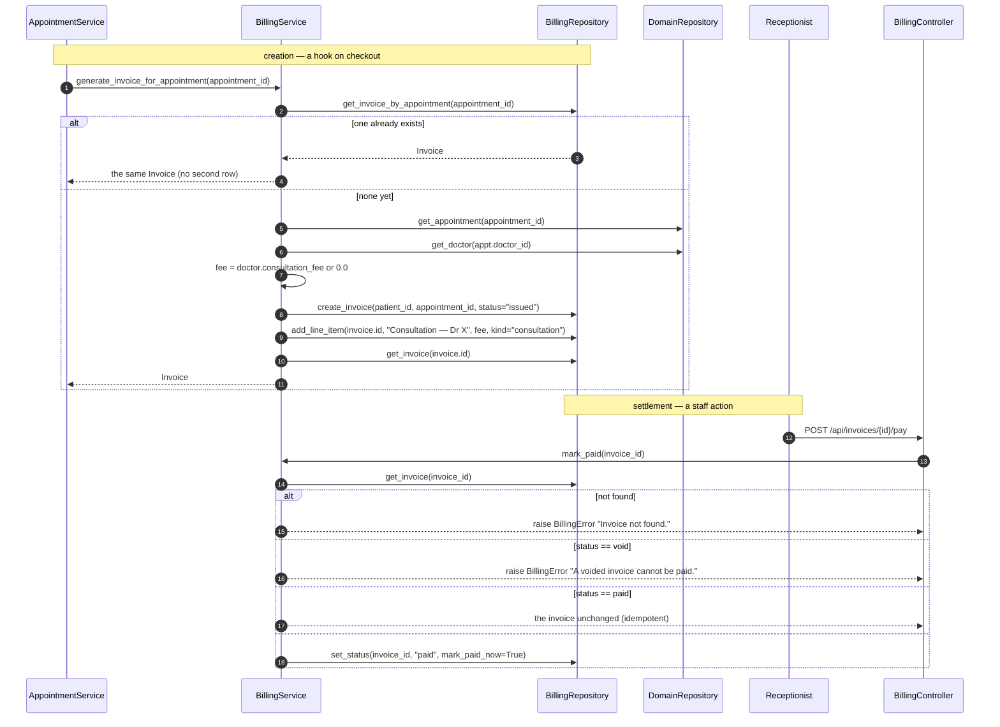
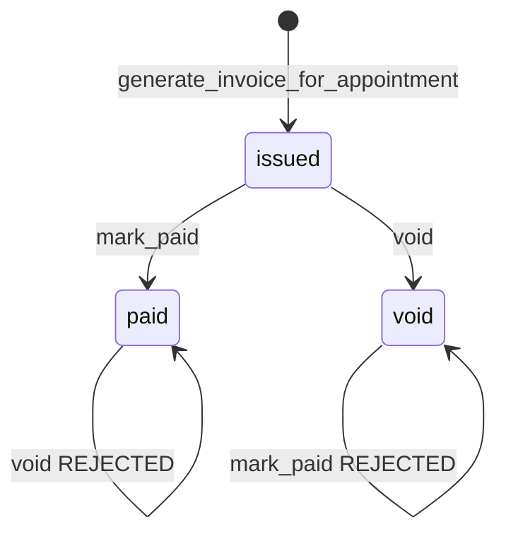

# Process — Invoice and payment

An invoice is drafted automatically at checkout and then settled or voided by
staff. Patients can read their own invoices; only staff can change them.

| | |
|---|---|
| **Created by** | `AppointmentService.checkout` → `BillingService.generate_invoice_for_appointment` |
| **Settled at** | `POST /api/invoices/{id}/pay` · `POST /api/invoices/{id}/void` |
| **Read at** | `GET /api/invoices/{id}` · `GET /api/patients/{id}/invoices` |
| **Tests** | [`tests/test_billing.py`](../backend/tests/test_billing.py) |

## Sequence

## Call chain

| # | Layer | Call | Access |
|---|---|---|---|
| 1 | Service | `BillingService.generate_invoice_for_appointment(appointment_id)` | Internal — called from `checkout` |
| 2 | Repository | `BillingRepository.get_invoice_by_appointment(id)` | The idempotency check |
| 3 | Repository | `BillingRepository.create_invoice(...)` + `add_line_item(...)` | |
| 4 | Controller | `BillingController.get(invoice_id)` → `BillingService.get_with_items(id)` | `require_role` — any authenticated user |
| 5 | Controller | `BillingController.list_for_patient(patient_id)` → `BillingService.list_for_patient(id)` | Any authenticated user |
| 6 | Controller | `BillingController.pay(invoice_id)` → `BillingService.mark_paid(id)` | **Staff only** |
| 7 | Controller | `BillingController.void(invoice_id)` → `BillingService.void(id)` | **Staff only** |

## Status rules

Both terminal states are one-way, enforced in `BillingService`, not the database:

- `mark_paid` on a **void** invoice → `BillingError("A voided invoice cannot be paid.")`
- `void` on a **paid** invoice → `BillingError("A paid invoice cannot be voided.")`
- `mark_paid` on an already-**paid** invoice returns it unchanged, so a
  double-clicked *Take payment* button is harmless.

`DomainErrorRegistrar` maps every `BillingError` to HTTP 400 with
`{"detail": ...}`, so the UI shows the sentence above verbatim.

## Two things worth knowing

**The invoice only ever holds the consultation fee.** `generate_invoice_for_appointment`
adds exactly one line item, priced from `Doctor.consultation_fee`. Medicines
dispensed during the visit decrement stock but are **never billed** — `Medicine.unit_price`
exists and is never read by the billing path. `InvoiceLineItem.kind` already
allows `"medicine"`, so the schema is ready for it; the code is not.

**A missing doctor prices the visit at zero.** `fee = float(doctor.consultation_fee) if doctor else 0.0`
means a dangling `doctor_id` produces a £0 invoice rather than an error.

## Access-control note

`GET /api/patients/{id}/invoices` and `GET /api/invoices/{id}` require *some*
authenticated user, but do not check that the caller is the patient the invoice
belongs to. Any logged-in user can read any invoice by id.
[`PatientInvoices.tsx`](../frontend/src/components/patients/PatientInvoices.tsx)
handles a 403 by hiding the panel, but the server does not issue one.

## Related

- [Visit lifecycle](process-visit-lifecycle.md) — where the invoice is created
- [Authentication](process-authentication.md) — how `require_role` gates these routes
