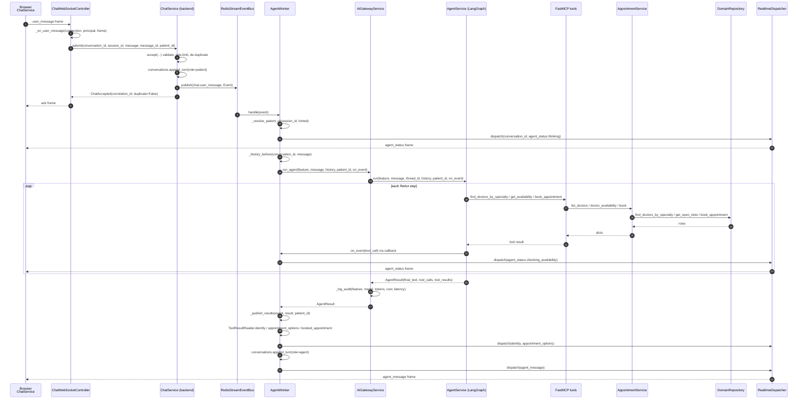

# Process — Book an appointment by chatting

A visitor books a doctor's appointment by talking to the assistant, with no
login and no form. This is the flagship path: it crosses the WebSocket gateway,
the event bus, the agent worker and the MCP tool server before it touches the
booking transaction.

| | |
|---|---|
| **Trigger** | Visitor sends a message on `/ws/chat` (or `POST /api/agent/appointment`) |
| **Entry point** | [`ChatWebSocketController.chat`](../backend/app/api/ws/chat.py) |
| **Ends with** | An `Appointment` row, a freed-no-longer slot, and an `agent_message` frame |
| **Auth** | None required — an anonymous guest session is minted server-side |
| **Tests** | [`tests/test_chat_gateway.py`](../backend/tests/test_chat_gateway.py) |

## Sequence

## Call chain, layer by layer

| # | Layer | Call | What it does |
|---|---|---|---|
| 1 | Transport | `WebSocketAuthenticator.authenticate(websocket)` | Resolves the principal from a JWT or mints a signed guest session |
| 2 | Transport | `ConversationService.resume_or_start(session_id, conversation_id, patient_id)` | Reuses the conversation only if it belongs to this session |
| 3 | Transport | `ConnectionManager.add(connection)` + `SessionRegistry.register_connection(...)` | Socket kept locally; the *owner* recorded in Redis |
| 4 | Transport | `ChatWebSocketController._on_user_message(...)` | Parses the frame; **ignores any `patient_id` the client sent** |
| 5 | Service | `ChatService.accept(...)` | Rejects empty/oversized/rate-limited messages, claims the idempotency key, persists the turn |
| 6 | Messaging | `RedisStreamEventBus.publish("chat.user_message", event)` | Hands the turn to the durable stream and returns — the socket is never blocked |
| 7 | Worker | `AgentWorker.handle(event)` | Claims `agent-run:{event_id}` so a redelivery cannot run the agent twice |
| 8 | Worker | `AgentWorker._resolve_patient_id(session_id, hinted)` | Re-reads identity from the Redis session, not from the wire |
| 9 | Worker | `ConversationService.history(conversation_id)` | Redis hot cache, falling back to `ConversationRepository.messages` |
| 10 | Gateway | `AIGatewayService.run_agent(...)` | Times the run and writes an `AuditEvent` — including on failure |
| 11 | Agent | `AgentService.run(...)` → `_run_langgraph(...)` | Replays history, streams `astream(stream_mode="updates")` |
| 12 | Tools | `book_appointment(patient_id, doctor_id, slot_id, reason)` | MCP tool → `mcp/tools.py` → `AppointmentService.book` |
| 13 | Service | `AppointmentService.book(...)` | Raises `AppointmentError` if the repository returns an error dict |
| 14 | Repository | `DomainRepository.book_appointment(...)` | **One transaction**: checks the slot is free and owned by the doctor, flips `is_booked`, inserts the `Appointment` |
| 15 | Worker | `ToolResultReader.identity(tool_results)` | Reads the resolved patient out of the tool output, server-side |
| 16 | Worker | `SessionRegistry.bind_patient(...)` + `ConversationService.bind_patient(...)` | Binds identity to the session; the browser is *told*, never asked |
| 17 | Realtime | `RealtimeDispatcher.dispatch(conversation_id, event)` | Local sockets directly; other instances via Redis Pub/Sub |

## Frames the browser sees

`ready` → `ack` → `agent_status` (one per tool call) → `identity` (once resolved)
→ `appointment_options` (if slots were offered) → `agent_message`.

Built by `ServerEvents.*` in [`app/realtime/protocol.py`](../backend/app/realtime/protocol.py);
consumed by `ChatService.onEvent` in [`frontend/src/lib/api/services/chat.ts`](../frontend/src/lib/api/services/chat.ts).

## Guarantees

- **No double-booking.** The slot check and the insert are a single transaction
  in `DomainRepository.book_appointment`. A second booking of the same slot gets
  `{"error": "Slot N is already booked."}`, which `AppointmentService.book`
  turns into an `AppointmentError`.
- **No double-run.** Two idempotency claims guard the path: `chat:{conversation_id}:{message_id}`
  when the message arrives, and `agent-run:{event_id}` when the worker picks it
  up. A resend is acked with `duplicate: true` and stops there.
- **Identity is never client-asserted.** Step 4 drops any `patient_id` in the
  frame; step 8 reads it from the Redis session; step 15 derives it from the
  agent's own tool output.
- **No fabricated success.** If the agent raises, `AgentWorker._fail` sends an
  `error` frame with `retryable: true` and publishes `agent.failed`. It does not
  re-run the turn, because that would re-call the booking tool.

## When it goes wrong

| Failure | Behaviour |
|---|---|
| Slot taken between offer and booking | Tool returns an error dict; the agent sees it and offers another slot |
| No LLM provider key | `AIGatewayService.run_agent` raises → `error` frame, `outcome="error"` audit row |
| MCP server down | Same as above — the agent has no tools and the turn fails visibly |
| Customer disconnects mid-turn | The reply is persisted first, then dispatched to nobody; it is replayed on reconnect (see [reconnect & resume](process-reconnect-resume.md)) |
| Redis dies mid-conversation | `ChatService.submit` falls back to `_run_degraded`, running the turn in-process |

## Related

- [Direct booking from the doctor page](process-direct-booking.md) — the non-chat path to the same transaction
- [Patient registration](process-patient-registration.md) — how a stranger gets a `patient_id` before step 12
- [Reconnect & resume](process-reconnect-resume.md)
- [Design.md §7, §11](Design.md)
