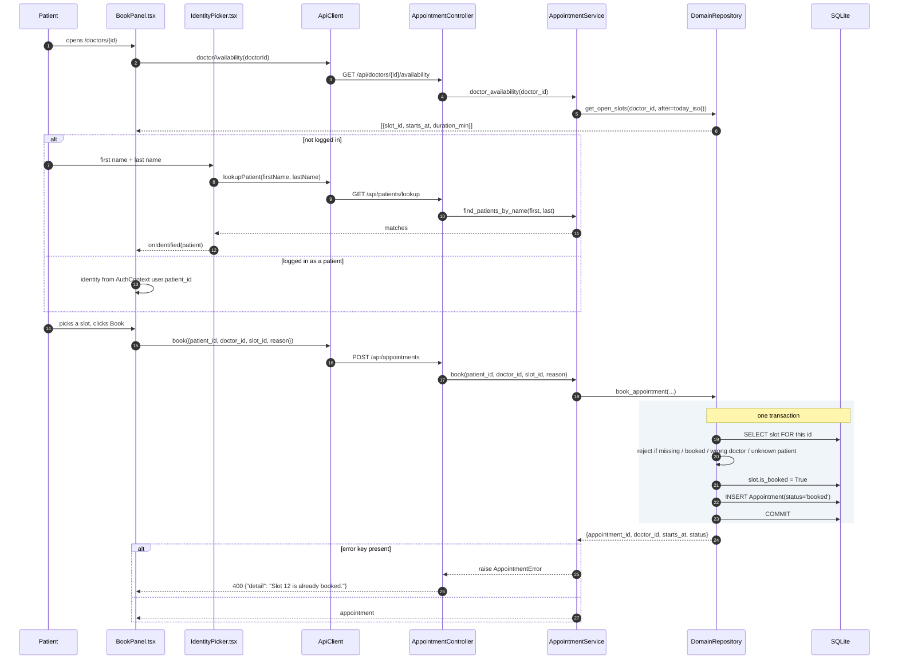

# Process — Book an appointment from the doctor page

The form-based path: a patient picks a day and a time chip on a doctor's page
and books. Same booking transaction as the chat path, three layers shorter.

| | |
|---|---|
| **Trigger** | Patient clicks *Book* in [`BookPanel`](../frontend/src/components/booking/BookPanel.tsx) |
| **Entry point** | `POST /api/appointments` → [`AppointmentController.book`](../backend/app/api/routes/appointments.py) |
| **Ends with** | An `Appointment` row and a slot flipped to `is_booked` |
| **Auth** | None enforced on the route — see [Known gap](#known-gap) |
| **Tests** | [`tests/test_appointment_flow.py`](../backend/tests/test_appointment_flow.py) |

## Sequence



## Call chain

| # | Layer | Call | Notes |
|---|---|---|---|
| 1 | Page | `BookPanel` → `api.doctorAvailability(doctorId)` | Only open slots from today onward |
| 2 | Controller | `DoctorController.availability(doctor_id)` | |
| 3 | Service | `AppointmentService.doctor_availability(doctor_id, after=None)` | Defaults `after` to `today_iso()` |
| 4 | Repository | `DomainRepository.get_open_slots(doctor_id, after)` | `is_booked == False`, sorted by `starts_at` |
| 5 | Page | `IdentityPicker` → `api.lookupPatient(first, last)` | Only when there is no logged-in patient |
| 6 | Service | `AppointmentService.find_patients_by_name(first, last)` | Case-insensitive |
| 7 | Page | `api.book({patient_id, doctor_id, slot_id, reason})` | |
| 8 | Controller | `AppointmentController.book(body)` | Pure pass-through — no logic in the controller |
| 9 | Service | `AppointmentService.book(...)` | Converts the repository's error dict into `AppointmentError` |
| 10 | Repository | `DomainRepository.book_appointment(...)` | The atomic step |
| 11 | Errors | `DomainErrorRegistrar` | Maps `AppointmentError` → HTTP 400 with `{"detail": ...}` |

## The four rejections inside the transaction

`DomainRepository.book_appointment` returns an error dict — writing nothing —
when any of these hold:

```python
if slot is None:                  return {"error": f"Slot {slot_id} does not exist."}
if slot.is_booked:                return {"error": f"Slot {slot_id} is already booked."}
if slot.doctor_id != doctor_id:   return {"error": "Slot does not belong to that doctor."}
if s.get(Patient, patient_id) is None:
                                  return {"error": f"Patient {patient_id} does not exist."}
```

The third one matters: without it, a caller could book doctor A's slot while
naming doctor B, and the appointment would point at the wrong clinician.

## Known gap

`POST /api/appointments` has **no `require_role` dependency**, and `patient_id`
comes from the request body. `IdentityPicker` also offers a "by patient ID" mode
that will accept any number. So this route lets a caller book on behalf of any
patient.

The chat path no longer has this weakness — identity there is derived from the
session server-side ([chat booking, step 4](process-chat-booking.md#call-chain-layer-by-layer)).
Closing it here means deriving `patient_id` from `get_current_user` for logged-in
callers and dropping the by-ID picker, which changes the no-login booking
behaviour the product currently relies on. It is recorded, not fixed.

## Related

- [Book by chatting](process-chat-booking.md)
- [Visit lifecycle](process-visit-lifecycle.md) — what happens after `booked`
- [Reschedule](process-reschedule.md)
