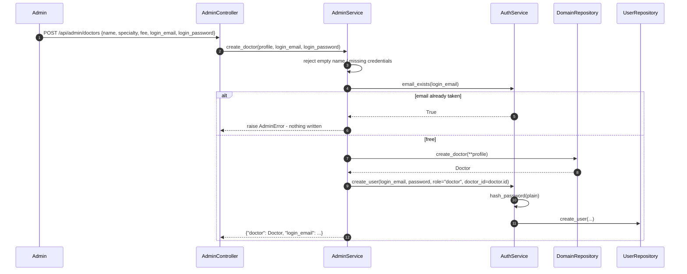
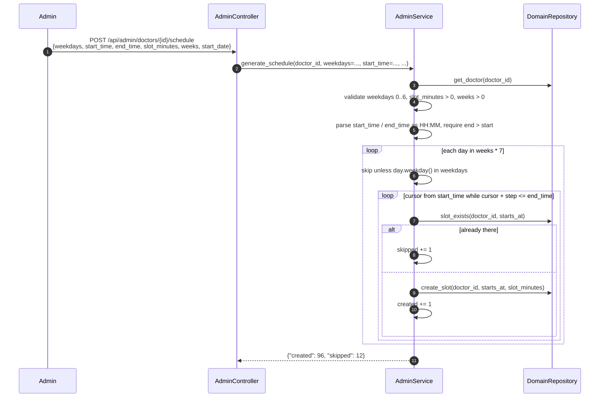

# Process — Onboard a doctor and build their schedule

An admin adds a doctor (which creates their login) and then expands a weekly
template into concrete bookable slots. Until this runs, a doctor has nothing to
book.

| | |
|---|---|
| **Trigger** | Admin console at `/admin/doctors` |
| **Entry points** | `POST /api/admin/doctors` · `POST /api/admin/doctors/{id}/schedule` |
| **Auth** | `require_role("admin")` on the whole controller |
| **Tests** | [`tests/test_admin.py`](../backend/tests/test_admin.py) |

## Part A — create the doctor and their login

### Why the pre-check matters

`AdminService.create_doctor` calls `AuthService.email_exists(login_email)`
**before** `DomainRepository.create_doctor`. Its own comment says why: *"so we
never leave an orphaned doctor row behind if the email is already taken."*

That is the correct ordering, and it is the one thing
[patient self-signup](process-patient-registration.md#the-ordering-hazard) does
not do — `AuthController.register` creates the `Patient` first and can strand it.
If you fix that, this method is the pattern to copy.

The login email is also merged onto the profile (`profile = {**profile, "email": login_email}`)
so the directory shows a contactable address.

## Part B — generate the schedule

### Call chain

| # | Layer | Call | Notes |
|---|---|---|---|
| 1 | Controller | `AdminController.generate_schedule(doctor_id, body: ScheduleTemplate)` | |
| 2 | Service | `AdminService.generate_schedule(doctor_id, weekdays=..., ...)` | All validation lives here |
| 3 | Repository | `DomainRepository.slot_exists(doctor_id, starts_at)` | The idempotency check, per slot |
| 4 | Repository | `DomainRepository.create_slot(doctor_id, starts_at, duration_min)` | |

### Validation, all in the service

| Rule | Error |
|---|---|
| Doctor must exist | `Doctor {id} not found.` |
| At least one weekday, each 0–6 | `Pick at least one valid weekday (0=Mon … 6=Sun).` |
| `slot_minutes > 0` and `weeks > 0` | `Slot length and number of weeks must be positive.` |
| `HH:MM` times | `Times must be in HH:MM format.` |
| `end_time > start_time` | `End time must be after start time.` |

### Idempotency

Re-running with an overlapping range is safe: `slot_exists` makes each slot a
no-op if it is already there, and the response reports `created` vs `skipped`
so the admin can see what actually happened. Extending two weeks to four is
therefore just a re-run with `weeks: 4`.

The `while cursor + step <= day_end` condition means a partial slot at the end
of the day is never created — a 09:00–17:00 day at 50-minute slots stops at
16:40 rather than spilling past closing.

## Part C — removing a slot

`DELETE /api/admin/slots/{id}` → `AdminService.remove_slot(slot_id)` →
`DomainRepository.delete_slot(slot_id)`. The repository refuses to delete a
booked slot; the service turns that `False` into
`AdminError("Slot not found, or it is already booked and can't be removed.")`,
so an admin cannot silently delete a patient's appointment out from under them.

## Related

- [Direct booking](process-direct-booking.md) — what consumes these slots
- [Patient registration](process-patient-registration.md) — the same two-record problem, handled less carefully
- [Authentication](process-authentication.md)
