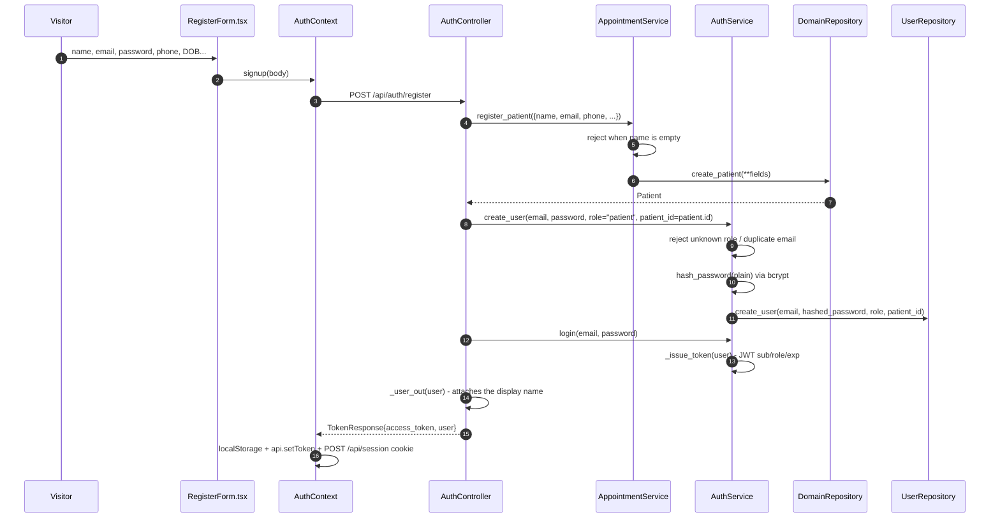
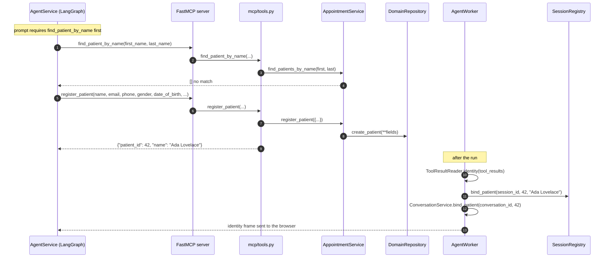

# Process — Register a patient

Three ways a `Patient` row comes into existence, ending in two different places:
with a login, or without one.

| Route | Creates | Login? | Who triggers it |
|---|---|---|---|
| `POST /api/auth/register` | `Patient` + `User` | Yes | Visitor on `/register` |
| `register_patient` MCP tool | `Patient` only | No | The chat agent, mid-conversation |
| `POST /api/patients` | `Patient` only | No | Staff / scripts |

| | |
|---|---|
| **Tests** | [`tests/test_auth.py`](../backend/tests/test_auth.py), [`tests/test_agent_tools.py`](../backend/tests/test_agent_tools.py) |

## A. Self-signup with a login

### Call chain

| # | Layer | Call |
|---|---|---|
| 1 | Controller | `AuthController.register(body: PatientSignupRequest)` |
| 2 | Service | `AppointmentService.register_patient(data)` — raises `AppointmentError` on an empty name |
| 3 | Repository | `DomainRepository.create_patient(**fields)` |
| 4 | Service | `AuthService.create_user(email, password, role="patient", patient_id=...)` |
| 5 | Service | `AuthService.hash_password(plain)` — bcrypt |
| 6 | Repository | `UserRepository.create_user(...)` |
| 7 | Service | `AuthService.login(email, password)` → `_issue_token(user)` |

### The ordering hazard

The `Patient` is created **before** the `User`. If `create_user` raises — a
duplicate email is the realistic case — the controller returns `400` but the
patient row has already been committed, leaving an orphan with no login. The
same request retried with a different email creates a *second* patient row for
the same person.

[`AdminService.create_doctor`](process-doctor-onboarding.md) solves exactly this
by calling `AuthService.email_exists(login_email)` **before** creating the
profile. Patient signup does not do that pre-check.

## B. Registered by the agent, mid-conversation

The assistant collects details in chat and calls the tool itself. No login is
created — the visitor stays anonymous, and the resulting `patient_id` is bound
to their guest session server-side.

### Why the lookup comes first

The system prompt in [`app/core/prompts.py`](../backend/app/core/prompts.py) makes
`find_patient_by_name` a precondition for `register_patient`, so a returning
patient is matched rather than duplicated. This is a prompt-level rule, not an
enforced one: `AppointmentService.register_patient` has no duplicate detection,
so a model that skips the step will create a second profile.

`ToolResultReader.identity` deliberately refuses to bind when a name lookup
returns **more than one** match — two people sharing a name is not an
identification, and the agent has to disambiguate in conversation first.

## C. Staff / script creation

`POST /api/patients` → `PatientController.create_patient(body)` →
`AppointmentService.register_patient(data)` → `DomainRepository.create_patient`.
Same service call as A and B, without any login or session binding. The route
carries no `require_role` dependency.

## Related

- [Book by chatting](process-chat-booking.md) — what the new `patient_id` is used for
- [Authentication](process-authentication.md)
- [Doctor onboarding](process-doctor-onboarding.md) — the same two-record problem, handled correctly
