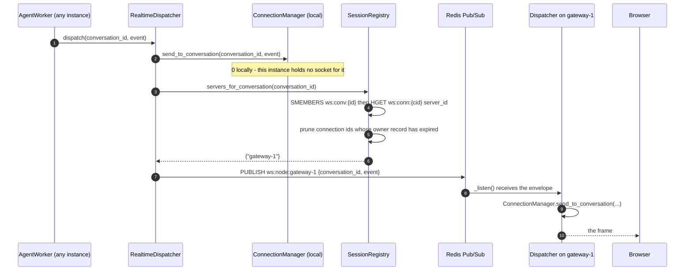
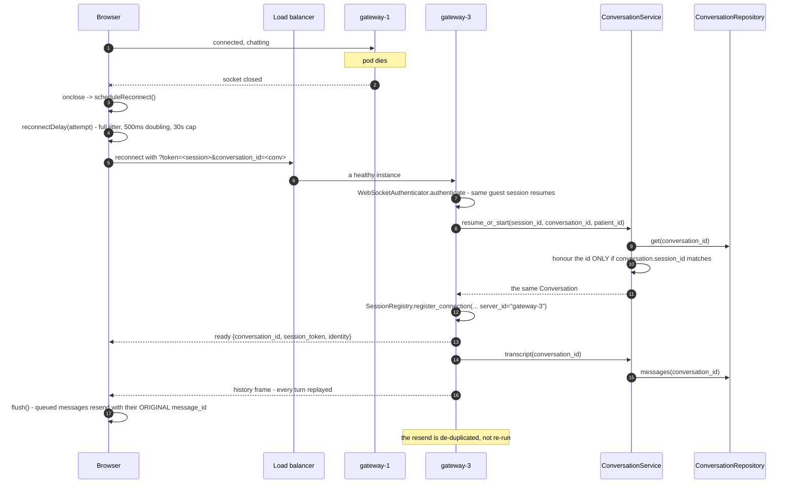

# Process — Reconnect, resume, and cross-instance delivery

The WebSocket is disposable; the conversation is not. This is the path a chat
takes when a pod dies, a laptop sleeps, or the agent finishes on a machine that
does not hold the customer's socket.

| | |
|---|---|
| **Client side** | [`RealtimeChatClient`](../frontend/src/lib/api/realtimeClient.ts) |
| **Server side** | [`SessionRegistry`](../backend/app/realtime/session_registry.py), [`RealtimeDispatcher`](../backend/app/realtime/dispatcher.py) |
| **Tests** | [`tests/test_redis_integration.py`](../backend/tests/test_redis_integration.py), [`tests/test_chat_gateway.py`](../backend/tests/test_chat_gateway.py) |

## A. Routing a reply to whoever owns the socket

The worker never assumes the customer is local. It asks Redis.

`RealtimeDispatcher.dispatch` returns the number of sockets **this** process
wrote to. Zero is not an error — it means nobody is connected, and the reply is
already persisted, so it will be replayed on the next connect.

## B. Reconnect and resume

### Call chain

| # | Layer | Call | Purpose |
|---|---|---|---|
| 1 | Client | `RealtimeChatClient.scheduleReconnect()` → `reconnectDelay(attempt)` | Full jitter, so a dead pod's clients do not stampede back together |
| 2 | Client | `RealtimeChatClient.url()` | Replays the stored `session_token` and `conversation_id` from `sessionStorage` |
| 3 | Server | `WebSocketAuthenticator._decode_guest(token)` | Same session id, so the resolved patient identity survives |
| 4 | Service | `ConversationService.resume_or_start(...)` | **Ownership check** — a foreign `conversation_id` silently starts a new conversation instead of leaking a transcript |
| 5 | Controller | `ChatWebSocketController._send_history(connection)` | Replays `ConversationService.transcript(...)` |
| 6 | Client | `RealtimeChatClient.flush()` | Resends queued frames, unchanged ids |
| 7 | Service | `ChatService.accept(...)` | `IdempotencyGuard` + `ConversationRepository.message_exists` reject the replay |

## C. Liveness

Two independent watchdogs, because a TCP connection can look open long after
the peer is gone.

| Side | Mechanism |
|---|---|
| Server | `ChatWebSocketController._heartbeat` sends `ping` every `ws_heartbeat_seconds` (25s). If no `pong` arrives within `interval * (missed_allowed + 1)`, it closes with code **4008**. |
| Server | The same loop calls `SessionRegistry.heartbeat(...)`, refreshing the TTL on `ws:conn:*`, `ws:conv:*`, `ws:server:*`. A pod that stops heart-beating stops being advertised as an owner within one TTL window (90s). |
| Client | `RealtimeChatClient.armWatchdog()` closes the socket itself if **no frame at all** arrives for `heartbeatSeconds * 2.5`, then reconnects. |
| Client | Answers server `ping` with `pong` inside `onMessage`, before the event reaches the UI. |

## D. Shutdown

`lifespan`'s `finally` calls `ConnectionManager.drain()`, closing every socket
with **1001 (going away)** before the process exits. Clients see a normal close,
back off with jitter, and land on a healthy instance — which restores the
conversation via the path in section B. This is the design document's
"connection draining" ([§19](Design.md)).

## What survives what

| Event | Transport state | Conversation |
|---|---|---|
| Socket drops | Lost | Intact — SQLite `Conversation` + `ChatMessage` |
| Pod restarts | Lost, registry entries expire | Intact |
| Redis restarts | Routing and sessions lost; app degrades to in-process | Intact |
| Both restart | Lost | Intact — the database is the only source of truth |

The one thing that does *not* survive a Redis restart is the **guest session's
resolved `patient_id`**: it lives only in `chat:session:{id}`. The visitor stays
in the same conversation, but the assistant has to re-identify them.

## Related

- [Book by chatting](process-chat-booking.md)
- [Design.md §13, §14, §17](Design.md)
