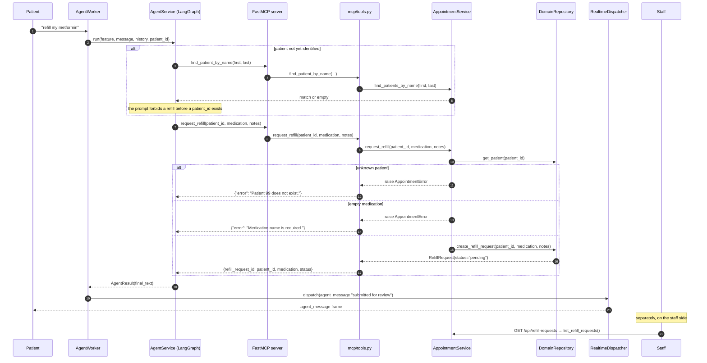

# Process — Request a prescription refill

A patient asks the assistant for a refill. The agent files a **request for staff
review** — it never dispenses, and it makes no clinical judgement. This is the
design document's rule that controlled decisions stay with trusted services
([§8, §16](Design.md)).

| | |
|---|---|
| **Trigger** | "Can I get a refill of my metformin?" on `/ws/chat` |
| **Entry point** | Same gateway as [chat booking](process-chat-booking.md) — this doc covers the tool call onward |
| **Ends with** | A `RefillRequest` row with `status="pending"` |
| **Reviewed at** | `GET /api/refill-requests` (doctor / receptionist / admin) |
| **Tests** | [`tests/test_agent_tools.py`](../backend/tests/test_agent_tools.py) |

## Sequence

## Call chain

| # | Layer | Call | Guard |
|---|---|---|---|
| 1 | Prompt | [`app/core/prompts.py`](../backend/app/core/prompts.py) | "Make sure the patient is identified first" |
| 2 | Tool | `request_refill(patient_id, medication, notes)` in [`app/mcp/server.py`](../backend/app/mcp/server.py) | Docstring tells the model a `patient_id` is required |
| 3 | Adapter | `mcp/tools.py:request_refill` | Catches exceptions and returns `{"error": ...}` so the agent can recover |
| 4 | Service | `AppointmentService.request_refill(patient_id, medication, notes)` | **Enforces** the patient exists and the medication is non-empty |
| 5 | Repository | `DomainRepository.create_refill_request(patient_id, medication, notes)` | Inserts with `status="pending"` |
| 6 | Controller | `OpsController.refill_requests()` → `AppointmentService.list_refill_requests()` | `require_role("doctor", "receptionist", "admin")` |

## What the agent is *not* allowed to do

| | |
|---|---|
| Dispense medicine | Only `PharmacyRepository.prescribe` does that, and it is reachable only from a doctor's treatment ([visit lifecycle](process-visit-lifecycle.md)) |
| Decide eligibility | There is no eligibility check anywhere; the request lands in a queue for a human |
| Touch stock | `RefillRequest` has no medicine foreign key and never adjusts `Medicine.stock_count` |
| Approve its own request | `status` is only ever written as `"pending"` here |

Step 4 is the important line: the guard is in the **service**, not the prompt.
A model that hallucinates a `patient_id` gets `AppointmentError` from
`DomainRepository.get_patient`, not a filed request.

## Gaps against the design document

[Design.md §8](Design.md) describes a longer refill workflow than this one:

| Blueprint | Here |
|---|---|
| `get_prescription()`, `check_eligibility()`, `submit_refill()` | One tool, `request_refill` |
| Pharmacy API called on a background worker, `REFILL_COMPLETED` event routed back | Synchronous insert; `Topics.REFILL_REQUESTED` / `REFILL_COMPLETED` are defined in [`app/messaging/events.py`](../backend/app/messaging/events.py) but nothing publishes or consumes them |
| Human approval step in the workflow | Implicit — the row sits at `pending` and there is no approve/deny endpoint |

Nothing here claims a refill was completed, which is the property
[§24](Design.md) actually cares about. The missing pieces are the asynchronous
completion path and a staff action to resolve the queue.

## Related

- [Book by chatting](process-chat-booking.md) — the transport this rides on
- [Visit lifecycle](process-visit-lifecycle.md) — where real dispensing happens
- [Design.md §8](Design.md)
