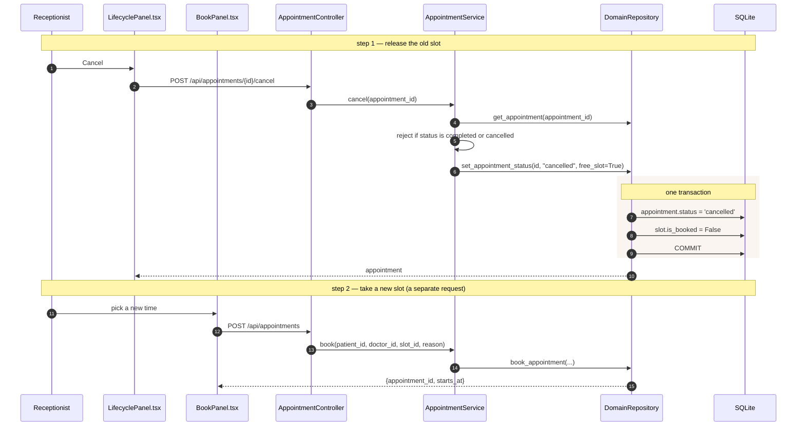

# Process — Reschedule an appointment

> **There is no reschedule operation in this codebase.** The design document
> ([§7, §10](Design.md)) specifies one — a `reschedule()` tool and a
> `POST /appointments/reschedule` endpoint with an idempotency key — but it was
> never built. What exists is *cancel, then book again*: two independent calls,
> from the front desk only.
>
> This document describes the real behaviour and what a proper reschedule would
> need, so nobody implements against the blueprint by mistake.

| | |
|---|---|
| **Today** | `POST /api/appointments/{id}/cancel` then `POST /api/appointments` |
| **Who can do it** | Reception/staff in the appointment page; **not** the chat agent |
| **Atomic?** | No — see [Why this is not a reschedule](#why-this-is-not-a-reschedule) |
| **Tests** | Cancel is covered in [`tests/test_appointment_flow.py`](../backend/tests/test_appointment_flow.py) |

## What actually happens

## Call chain

| # | Layer | Call | Notes |
|---|---|---|---|
| 1 | Controller | `AppointmentController.cancel(appointment_id)` | |
| 2 | Service | `AppointmentService.cancel(appointment_id)` | Refuses when status is `completed` or `cancelled` |
| 3 | Repository | `DomainRepository.set_appointment_status(id, "cancelled", free_slot=True)` | `free_slot=True` is what returns the slot to the pool |
| 4 | Controller | `AppointmentController.book(body)` | A brand-new appointment row — the old id is not reused |
| 5 | Repository | `DomainRepository.book_appointment(...)` | See [direct booking](process-direct-booking.md) |

## Why this is not a reschedule

| Property a reschedule needs | Cancel-then-book |
|---|---|
| Atomic | **No.** The two calls are independent. If the second fails, the patient has lost their appointment and holds nothing. |
| Race-free | **No.** Between the calls, the freed slot *and* the intended new slot are both open to anyone. |
| Idempotent | **No.** `POST /api/appointments` takes no idempotency key, so a retried request books a second appointment. |
| Traceable as one act | **No.** Two rows, no link between them; the audit trail shows an unrelated cancellation and booking. |
| Available to the agent | **No.** The MCP tool set is `get_doctors`, `find_doctors_by_specialty`, `get_availability`, `book_appointment`, `get_patient`, `find_patient_by_name`, `register_patient`, `request_refill`. There is no cancel or reschedule tool, so the assistant cannot move an appointment. |

## What a real reschedule would take

Roughly, in the order the layers would change:

1. **Repository** — `DomainRepository.reschedule_appointment(appointment_id, new_slot_id)`:
   one transaction that frees the old slot, claims the new one (with the same
   four checks `book_appointment` makes), and updates `starts_at`/`slot_id` on
   the existing row.
2. **Service** — `AppointmentService.reschedule(appointment_id, new_slot_id)`
   guarding the lifecycle: only a `booked` appointment can move, never one that
   is `in_treatment`, `completed` or `cancelled`.
3. **Controller** — `POST /api/appointments/{id}/reschedule` honouring an
   `Idempotency-Key` header via the existing
   [`IdempotencyGuard`](../backend/app/core/coordination.py), which already backs the
   chat path.
4. **Tool** — a `reschedule_appointment` MCP tool in
   [`app/mcp/server.py`](../backend/app/mcp/server.py) plus a matching
   [`ToolResultReader`](../backend/app/realtime/tool_results.py) branch, so the chat
   agent can offer new slots and the UI can show them as chips.
5. **Prompt** — a reschedule section in
   [`app/core/prompts.py`](../backend/app/core/prompts.py), mirroring the booking and
   refill sections.

Steps 1–3 alone would make the front-desk flow correct. Steps 4–5 are what
close the gap against [Design.md §7](Design.md).

## Related

- [Direct booking](process-direct-booking.md)
- [Visit lifecycle](process-visit-lifecycle.md) — the states that block a move
- [Design.md §7 (reschedule trace), §15 (idempotency)](Design.md)
