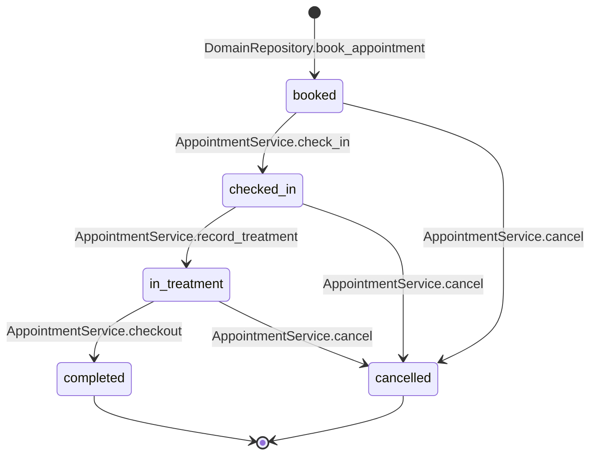
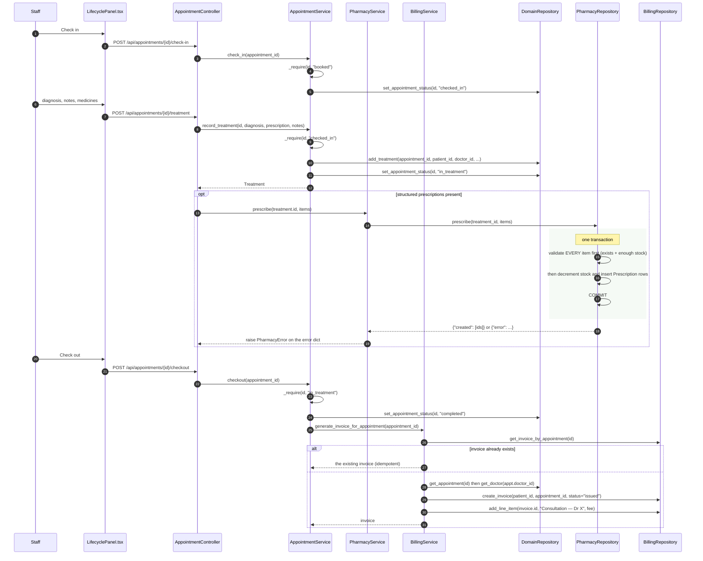

# Process — The visit: check-in → treatment → checkout

The front-desk and clinical path a booked appointment travels, ending in an
invoice. Every transition is validated in the service layer, so no caller can
skip a state.

| | |
|---|---|
| **Trigger** | Staff act on `/appointments/{id}` via [`LifecyclePanel`](../frontend/src/components/appointments/LifecyclePanel.tsx) |
| **Entry points** | `POST /api/appointments/{id}/check-in`, `/treatment`, `/checkout`, `/cancel` |
| **Ends with** | `Appointment.status = completed` and an issued `Invoice` |
| **Tests** | [`tests/test_appointment_flow.py`](../backend/tests/test_appointment_flow.py), [`tests/test_pharmacy.py`](../backend/tests/test_pharmacy.py), [`tests/test_billing.py`](../backend/tests/test_billing.py) |

## The state machine

`AppointmentService._require(appointment_id, expected)` is the gate: it loads
the appointment and raises `AppointmentError` unless the current status is
exactly the one the transition expects. `cancel` is the exception — it accepts
any status except `completed` and `cancelled`, and passes `free_slot=True` so
the slot returns to the pool.

## Sequence

## Call chain

| # | Layer | Call | Guard |
|---|---|---|---|
| 1 | Controller | `AppointmentController.check_in(appointment_id)` | |
| 2 | Service | `AppointmentService.check_in(id)` | `_require(id, "booked")` |
| 3 | Controller | `AppointmentController.treatment(appointment_id, body)` | |
| 4 | Service | `AppointmentService.record_treatment(id, diagnosis, prescription, notes)` | `_require(id, "checked_in")` |
| 5 | Repository | `DomainRepository.add_treatment(...)` then `set_appointment_status(id, "in_treatment")` | |
| 6 | Service | `PharmacyService.prescribe(treatment_id, items)` | Called from the controller so the doctor's screen stays one request |
| 7 | Repository | `PharmacyRepository.prescribe(treatment_id, items)` | Validate-all-then-write; no partial dispense |
| 8 | Controller | `AppointmentController.checkout(appointment_id)` | |
| 9 | Service | `AppointmentService.checkout(id)` | `_require(id, "in_treatment")` |
| 10 | Service | `BillingService.generate_invoice_for_appointment(id)` | Idempotent on `appointment_id` |

## Guarantees

- **No negative stock.** `PharmacyRepository.prescribe` checks *every* item
  before writing *any* of them, so a five-medicine prescription that is short on
  the fourth writes nothing and reports which medicine ran out.
- **No skipped states.** `_require` means you cannot check out an appointment
  that was never checked in — a direct `POST .../checkout` on a `booked` row
  returns `400 Appointment is 'booked', expected 'in_treatment'.`
- **No duplicate invoices.** `generate_invoice_for_appointment` returns the
  existing invoice when one already exists, so a retried checkout cannot bill
  twice.
- **Cancelling frees the slot.** `set_appointment_status(..., free_slot=True)`
  flips `is_booked` back in the same transaction.

## Two things worth knowing

**Dispensing lives in the controller, not the service.** `AppointmentController.treatment`
calls `AppointmentService.record_treatment` and then `PharmacyService.prescribe`.
That keeps the doctor's workflow one HTTP request, but it means the treatment
row and the stock decrement are **two transactions** — a prescribe failure
leaves the treatment recorded with no medicines dispensed. The visible result is
a 400 with the stock message, and the treatment already saved.

**Checkout's invoice is a hook, not a transaction.** `AppointmentService.checkout`
sets `completed` first, then calls billing. If invoice creation raised, the
appointment would already be `completed`. It is guarded by the idempotency
check, so re-running checkout is safe — but the failure is not rolled back.

## Related

- [Billing](process-billing.md) — what happens to the invoice afterwards
- [Direct booking](process-direct-booking.md) — how a row reaches `booked`
- [Reschedule](process-reschedule.md) — the states that block a move
